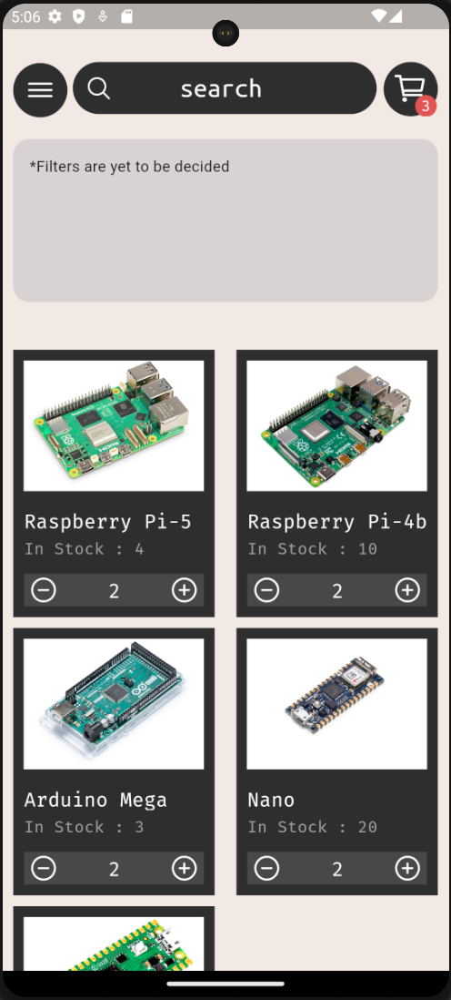
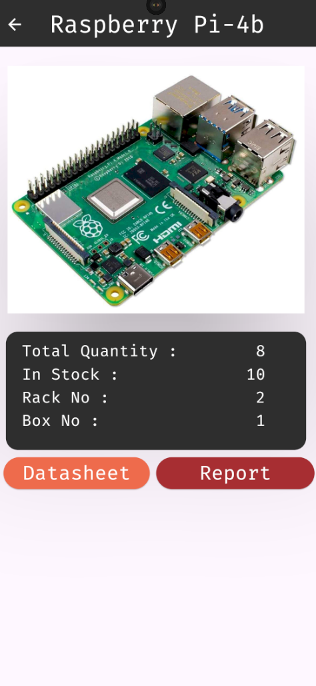

# CircuitVault - Frontend/User Interface

## Project Structure

The **lib** folder contains the following sections:

- **screens**: This folder contains the various pages you see in the app. Each page is composed of widgets.
  
- **widgets**: Reusable components/widgets used across different pages for consistent UI design.
  
- **models**: Contains useful abstractions and data models that simplify data handling and logic.
  
- **assets**: Includes various static resources such as images, icons, and documents.

## Status

- **Last Update**: October 18th 2024

- Fixed Bugs Related to rendering of widgets on screen
- implemented gridview.builder()
- implemented dynamic reloading of objects on the home.dart

- Created the Component View Widget
- Few bugs to be sorted out
